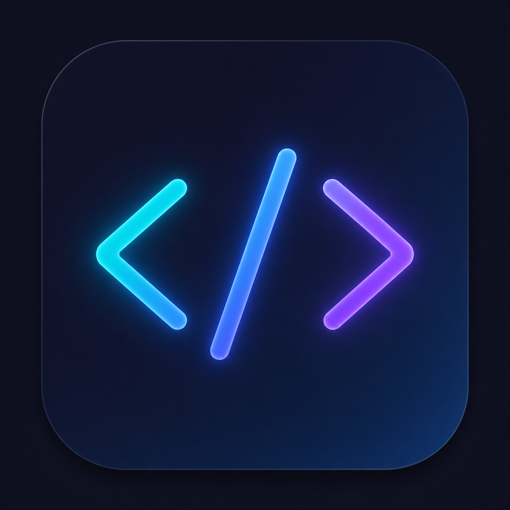

# 🚀 CodeStudio — Production-Grade Universal Code & Text Editor

<p align="center">
  
</p>

<p align="center">
  <strong>The Ultra-Fast, Lightweight, and Extensible VS Code / VSCodium Alternative for Web & Desktop</strong>
</p>

<p align="center">
  <a href="https://codestudio-web-app.pages.dev/"></a>
  <a href="https://github.com/SudhirDevOps1/CodeStudio.git"></a>
  <a href="https://github.com/SudhirDevOps1/CodeStudio/actions"></a>
  
  
  
</p>

---

## 📌 Quick Access & Deployment
- 🌐 **Live Web Application**: [https://codestudio-web-app.pages.dev/](https://codestudio-web-app.pages.dev/)
- 📦 **GitHub Repository**: [https://github.com/SudhirDevOps1/CodeStudio.git](https://github.com/SudhirDevOps1/CodeStudio.git)
- 🚀 **GitHub Releases & `.exe` Downloads**: [https://github.com/SudhirDevOps1/CodeStudio/releases](https://github.com/SudhirDevOps1/CodeStudio/releases)
- 💻 **Desktop Executable (`.exe`)**: Built via `npm run electron:build` (Outputs `CodeStudio Setup 1.0.0.exe` NSIS Installer and portable executable in `dist-electron/`)
- ⚡ **Zero Setup Required**: Open directly in any modern browser or run as a standalone desktop executable on Windows.

---

## 🌟 Key Highlights & Feature Matrix

### ⚡ 1. Quick Open File Switcher (`Ctrl + P`) & Go to Line (`Ctrl + G`)
- **Instant Fuzzy File Search (`Ctrl + P`)**: Open the fuzzy file picker from anywhere to jump across workspace files in sub-milliseconds without touching your mouse.
- **Go to Line Number (`Ctrl + G` or `:line`)**: Jump directly to any line number (e.g. `:45`) with automatic viewport centering and cursor positioning.
- **Keyboard Navigation**: Smooth `<kbd>↑</kbd> <kbd>↓</kbd>` arrow navigation with `<kbd>Enter</kbd>` to select and open.

### 🔍 2. Global Workspace Search & Multi-File Replace (`Ctrl + Shift + F`)
- **Advanced Match Filters**: Case Sensitive (`Aa`), Whole Word (`\b`), and Regular Expressions (`.*`).
- **Grouped File Collapsible View**: File-by-file match grouping with match counts and clickable line snippets.
- **Batch Replace All**: Replace matches in individual files or click **"All"** to execute a workspace-wide batch replacement with atomic state saves and success toasts.

### 🧩 3. Extensions Marketplace (`Ctrl + Shift + X`)
Just like VS Code and VSCodium, CodeStudio features a full **Extensions Marketplace**:
- **Marketplace Tab**: Browse curated developer tools and live query the **Open VSX Registry** (`https://open-vsx.org/api/-/search`).
- **Installed Tab**: Real-time counter badge, enable/disable toggles, and one-click uninstall.
- **Popular Tab**: Filter community-favorite and highly-rated extensions.
- **Smart Category Fallback & Fuzzy Search**: Searching queries like `live preview` automatically finds relevant tools across categories with typo tolerance.
- **Included Extensions**: Live Preview & Simple Browser, Live Server, One Dark Pro, Catppuccin, Tokyo Night, Prettier Formatter, ESLint, React Snippets, Mermaid Chart, and more.
- **Persistent Storage**: Installed extensions and preferences are stored locally in IndexedDB (`idb-keyval`).

### 🌐 4. Built-In Webview & Simple Browser
Browse live documentation and test local development servers right next to your code:
- **Internet & Localhost Access**: Test `http://localhost:3000`, `http://localhost:5173`, or live URLs without CORS blockers.
- **Browser Navigation**: Back, Forward, Reload (`RotateCw`), Home buttons, and smart address bar with automatic protocol resolution.
- **Quick Bookmarks**: One-click shortcuts for `Localhost:5173`, `Localhost:3000`, `Tailwind Docs`, `React Docs`, `MDN Web Docs`, and `GitHub`.
- **Multi-Device Responsive Presets**: Toggle between **Responsive (100%)**, **Desktop (1200px)**, **Tablet iPad (768px)**, and **Mobile iPhone (375px)**.
- **External Launch**: Open any active URL in your default system browser with a single click (`ExternalLink`).

### 📁 5. Native File Explorer with Drag & Drop (`Ctrl + O`, `Ctrl + Shift + O`)
- **HTML5 Drag & Drop**: Drag and drop files/folders directly into target folders in the tree with visual outline indicators.
- **Open System Folder**: Recursive directory import via native OS Dialog (Electron) and browser File System Access API (`showDirectoryPicker()`).
- **Open System File**: Binary and text file picker with automatic language detection.
- **In-App Modal Dialogs**: Custom dark-themed dialogs for new files/folders (no native browser `prompt()` popups).
- **ZIP Auto-Extraction & Export**: Drag-and-drop `.zip` files to extract nested structures, or export the entire workspace into a `.zip` archive with one click.

### 🎨 6. 10 Dynamic Editor Themes & 100% Offline Monaco Engine
- **100% Offline Bundling**: Monaco Editor is bundled directly into the app (`loader.config({ monaco })`), ensuring instant (< 50ms) offline loading with 0 CDN delays or network dependencies.
- **10 Pre-Installed Editor Themes**:
  1. **VS Code Dark (Default)**
  2. **One Dark Pro (Atom)**
  3. **Catppuccin Macchiato**
  4. **Tokyo Night**
  5. **SynthWave '84 (80s Neon Glow)**
  6. **Dracula Official**
  7. **Nord Arctic**
  8. **Monokai Pro**
  9. **GitHub Dark High Contrast**
  10. **VS Code Light**
- **6 Accent Colors**: Electric Blue, Deep Purple, Emerald, Amber, Rose, Cyan.
- **Typography Controls**: Font size (10–28px), line numbers (on/off/relative), cursor style (line, block, underline), word wrap, minimap toggle.

### 🎛️ 7. Interactive Status Bar Click Controls
- **Line/Col Jumper**: Clicking `Ln X Col 1` opens the Go to Line modal (`Ctrl + G`).
- **Indentation Picker**: Clicking `Spaces: X` opens a popover to switch indentation (2 spaces, 4 spaces) and toggle Word Wrap.
- **Language Mode**: Displays current language with one-click access to settings.
- **Unsaved Indicator**: Live `Ctrl + S` reminder badge and instant save trigger.

### ⚙️ 8. Multi-Language Runner & Compilers
| Language / Environment | Execution Method | Output & Features |
|---|---|---|
| **TypeScript / TSX** | In-Browser Babel Type Stripping | Fast console output with execution duration timer |
| **JavaScript / JSX** | In-Browser Sandbox | Object inspect, multi-line format, standard output |
| **Python** | Pyodide WebAssembly (CDN) | Client-side Python execution without server |
| **C / C++ GCC** | Desktop Electron Native Runner | Calls system `gcc`/`g++` directly from desktop `.exe` |
| **Cloudflare Sandbox** | Optional Worker Endpoint | Serverless sandbox integration |

### 🖼️ 9. Universal File & Media Previews
- **Markdown & Mermaid**: Real-time markdown preview with live SVG rendering for `.mermaid` and `.mmd` diagrams with synchronized scrolling.
- **HTML / Web Sandbox**: Live multi-device responsive iframe preview.
- **Spreadsheets**: SheetJS-powered tabular viewer for Excel (`.xlsx`, `.xls`, `.xlsm`), CSV, TSV, and JSON with binary export.
- **Media Player**: Built-in player for Audio (`.mp3`, `.wav`, `.ogg`, `.flac`) and Video (`.mp4`, `.webm`, `.mov`).
- **Documents & Vector Graphics**: Multi-page PDF viewer with zoom, and SVG graphics live preview with code-back sync.
- **Images**: High-resolution zoom, rotate, fullscreen mode for PNG, JPG, GIF, WebP, ICO.

### 🌿 10. Git & Source Control Panel (`Ctrl + Shift + G`)
- Real-time file change tracker with `M` badge and modified file count.
- Stage / Unstage individual files or Stage All.
- Commit with custom messages and persistent commit history timeline.
- Active branch indicator (`main`).

### 💻 11. Integrated Terminal (`` Ctrl + ` ``)
- Full interactive CLI with workspace state commands: `ls`, `cat`, `touch`, `rm`, `open`, `stats`, `eval`, `clear`, `date`, `pwd`, `theme`, `version`, `help`.
- Resizable top drag handle, minimize, maximize, and timestamp logs.

### 📸 12. Built-in Code Snapshot Image Generator
- Export beautiful Carbon-style code snippets directly to high-resolution PNG images.
- Customizable gradient backgrounds (Electric Blue, Purple Horizon, Emerald Glow) with custom branding.

---

## ⌨️ Complete Keyboard Shortcuts Cheatsheet

| Category | Shortcut | Action |
|---|---|---|
| **Navigation** | `Ctrl + P` | **Quick Open File Switcher** |
| | `Ctrl + G` | **Go to Line Number (`:line`)** |
| | `Ctrl + Shift + P` | Open Command Palette |
| | `Ctrl + Shift + X` | Extensions Marketplace |
| | `Ctrl + Shift + E` | Focus File Explorer |
| | `Ctrl + Shift + F` | **Focus Workspace Search & Replace** |
| | `Ctrl + Shift + G` | Source Control / Git |
| | `` Ctrl + ` `` | Toggle Integrated Terminal |
| | `F1` / `Ctrl + /` | Keyboard Shortcuts Help |
| **File Operations** | `Ctrl + O` | Open File from System |
| | `Ctrl + Shift + O` | Open Folder from System |
| | `Ctrl + S` | Save Active File |
| | `Ctrl + W` | Close Active Tab |
| | `Ctrl + F` | Monaco In-File Find & Replace |
| | `Shift + Alt + F` | Format Document (Prettier) |
| | `Esc` | Close Dialogs / Exit Zen Mode |
| **Multi-Cursor Editing** | `Alt + Click` | Add Multiple Cursors |
| | `Ctrl + Alt + Up/Down` | Add Cursor Above/Below |
| | `Shift + Alt + Down` | Duplicate Line Down |

---

## 🤖 Automated CI/CD & Release Workflow

CodeStudio includes a production-grade **GitHub Actions CI/CD Pipeline** (`.github/workflows/build.yml`):
- 🌐 **Web Build Job**: Automatically runs strict TypeScript check (`npm run typecheck`) and packages single-file web bundle (`npm run build`).
- 🖥️ **Windows Desktop Build Job**: Automatically compiles Electron runtime, bundles assets, and builds Windows NSIS Installer (`.exe`) and Portable executable on `windows-latest`.
- 🚀 **Automated Tag Releases**: Pushing any tag (e.g. `git tag v1.0.0 && git push --tags`) automatically creates a GitHub Release with installer `.exe` attachments and web `.zip` archives.

---

## 🛠️ Tech Stack & Architecture

```
CodeStudio Core Stack
├── Frontend Engine: React 18 + Vite 7 + Tailwind CSS 4
├── Code Editing: Monaco Editor Core (@monaco-editor/react + monaco-editor bundled)
├── Extensions Engine: Zustand + IndexedDB (idb-keyval) + Open VSX API
├── Desktop Runtime: Electron 43 + Electron Builder (NSIS / Portable)
├── CI/CD & Builds: GitHub Actions (.github/workflows/build.yml)
├── Media & Previews: SheetJS (XLSX) + Mermaid.js + react-markdown + Babel
└── Single-File Bundle: vite-plugin-singlefile (Zero 404 / Direct file:// load)
```

---

## 🚀 Getting Started & Build Commands

### 1. Prerequisites
- Node.js `v18.0.0` or higher
- npm `v9.0.0` or higher

### 2. Installation
```bash
git clone https://github.com/SudhirDevOps1/CodeStudio.git
cd CodeStudio
npm install
```

### 3. Local Web Development
```bash
npm run dev
# Starts local Vite dev server at http://localhost:5173
```

### 4. TypeScript Strict Verification
```bash
npm run typecheck
# Strict tsc --noEmit check (0 errors)
```

### 5. Production Web Build
```bash
npm run build
# Generates optimized singlefile bundle in dist/index.html (~4.8MB / 1.37MB gzipped)
```

### 6. Desktop Development (Electron)
```bash
npm run electron:dev
# Launches hot-reloading desktop window
```

### 7. Build Windows Executable Installer (`.exe`)
```bash
npm run electron:build
# Generates CodeStudio Setup 1.0.0.exe (NSIS Installer) and CodeStudio 1.0.0.exe (Portable) in dist-electron/
```

---

## 📁 Repository Structure

```
CodeStudio/
├── .github/
│   └── workflows/
│       └── build.yml               # Automated CI/CD Web & Desktop Electron Release pipeline
├── public/
│   └── icon.png                    # High-res application icon
├── electron/
│   ├── main.js                     # Electron main process (IPC, menus, webSecurity)
│   └── preload.js                  # Context-isolated secure bridge
├── src/
│   ├── components/
│   │   ├── editor/                 # Monaco Editor wrapper, local loader & 10 theme definitions
│   │   ├── extensions/             # Extension details modal & README reader
│   │   ├── filetree/               # Explorer tree, Drag & Drop, icons, and dialogs
│   │   ├── preview/                # Markdown, Mermaid, HTML, Simple Browser Webview, Spreadsheets, Media
│   │   ├── sidebar/                # ActivityBar, Extensions, Git, Global Search & Replace, Snippets
│   │   ├── statusbar/              # Interactive status bar, indentation & word-wrap popover
│   │   ├── tabs/                   # Tab bar with preview mode toggles & webview button
│   │   └── ui/                     # QuickOpenModal, Terminal, Command Palette, Modals, MenuBar
│   ├── data/                       # Default extensions catalog (Live Preview, Themes, Snippets)
│   ├── stores/                     # Zustand stores (Files, Settings, Extensions, Dialogs)
│   ├── types/                      # TypeScript definitions (Files, Settings, Extensions)
│   ├── utils/                      # File helpers, base64 binary converters, ZIP handlers
│   ├── App.tsx                     # Main layout & global keyboard shortcut hub
│   ├── index.css                   # Global styles, scrollbars, animations
│   └── main.tsx                    # React DOM root entry with offline Monaco binding
├── skill.md/                       # Continuous project memory, changelog, and specifications
├── package.json                    # Scripts, dependencies, and build configuration
├── vite.config.ts                  # Vite, singlefile, and Tailwind configuration
├── tsconfig.json                   # Strict TypeScript compiler options
└── README.md                       # Comprehensive documentation
```

---

## 🥊 CodeStudio vs VS Code / VSCodium

| Feature | Standard VS Code | CodeStudio |
|---|---|---|
| **Installation** | Required (~300MB download) | **Zero-Install Web** or Lightweight Desktop App |
| **Startup Time** | 2–5 Seconds | **< 800ms Instant Startup** |
| **Quick Open & Line Jump** | Built-in | **Built-in `Ctrl + P` & `Ctrl + G`** |
| **Global Search & Replace** | Built-in | **Built-in multi-file regex & batch Replace All** |
| **Monaco Offline Bundle** | Local | **100% Offline Bundled (0 CDN Delay)** |
| **Extensions Marketplace** | Proprietary Marketplace | **Curated Catalog + Open VSX Live Registry** |
| **Built-in Webview Browser** | Complex configuration | **One-click Simple Browser with Localhost & Bookmarks** |
| **Spreadsheet Viewer** | Third-party extension needed | **Built-in SheetJS (Excel, CSV, TSV, JSON)** |
| **ZIP File Handling** | Manual extract required | **Built-in drag-and-drop extraction & export** |
| **Carbon Code Snapshots** | Extension needed | **Built-in beautiful image generator** |
| **Privacy & Telemetry** | Microsoft telemetry active | **100% Client-side, zero tracking, zero analytics** |

---

## 🤝 Contributing
Contributions, issues, and feature requests are welcome!
1. Fork the Project
2. Create your Feature Branch (`git checkout -b feature/AmazingFeature`)
3. Commit your Changes (`git commit -m 'Add some AmazingFeature'`)
4. Push to the Branch (`git push origin feature/AmazingFeature`)
5. Open a Pull Request

---

## 📜 License
Distributed under the **MIT License**. Free for personal, commercial, and open-source use.

---

<p align="center">
  Crafted with ❤️ by <strong>SudhirDevOps</strong> • Universal CodeStudio Editor
</p>
<p align="center">
  <strong>⭐ Star this repository on GitHub if you love this project!</strong>
</p>
